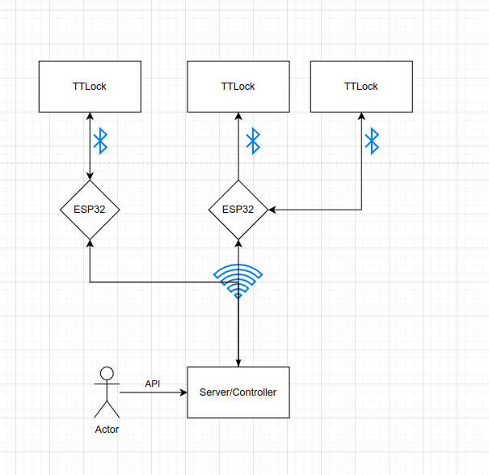
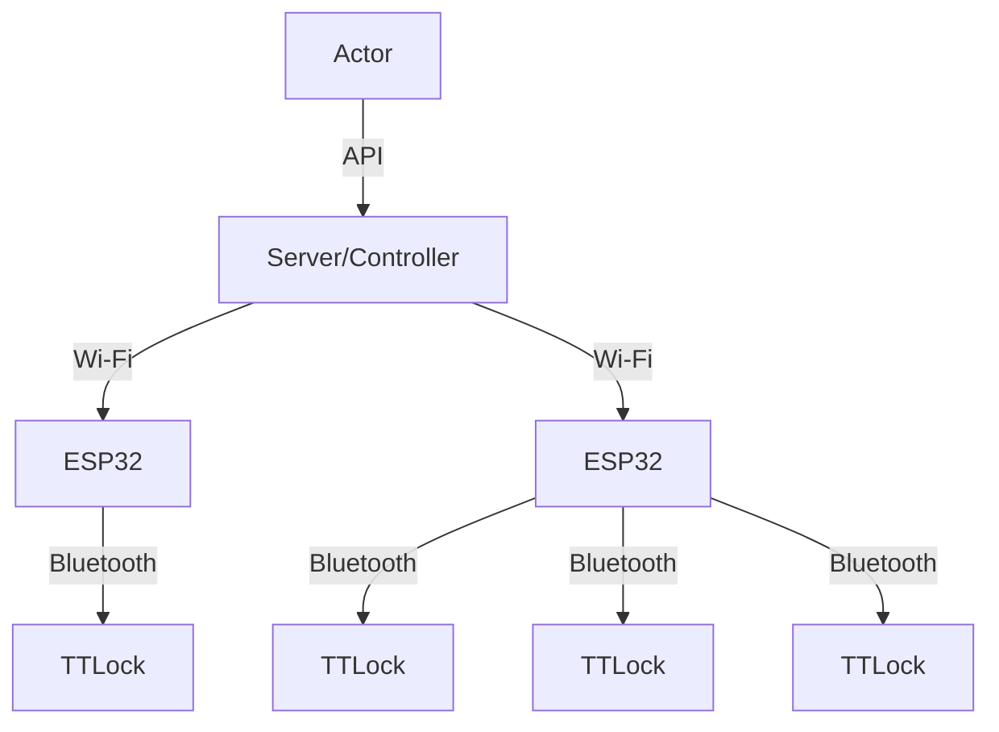
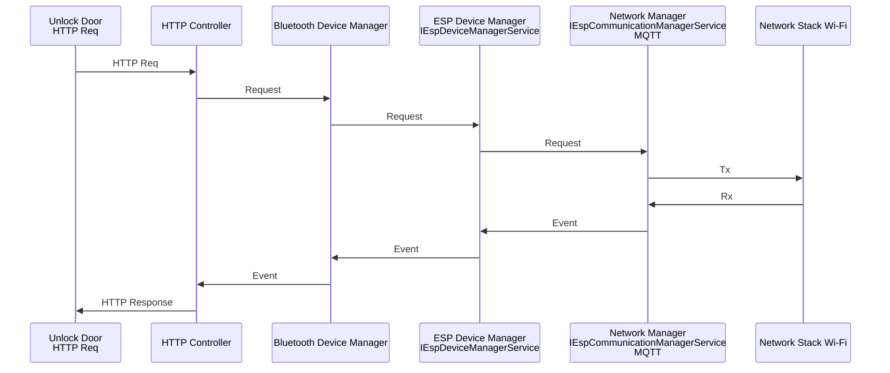

# TTLock Controller

```mermaid
flowchart TD
    actor[Actor] -->|API| server[Server/Controller]
    server -->|Wi-Fi| esp1[ESP32]
    server -->|Wi-Fi| esp2[ESP32]
    esp1 -->|Bluetooth| ttlock1[TTLock]
    esp2 -->|Bluetooth| ttlock2[TTLock]
    esp2 -->|Bluetooth| ttlock3[TTLock]
    esp2 -->|Bluetooth| ttlock4[TTLock]
```

```mermaid
sequenceDiagram
    participant UnlockDoor as Unlock Door <br> HTTP Req
    participant HTTPController as HTTP Controller
    participant BluetoothManager as Bluetooth Device Manager
    participant ESPDeviceManager as ESP Device Manager <br> IEspDeviceManagerService
    participant NetworkManager as Network Manager <br> IEspCommunicationManagerService <br> MQTT
    participant NetworkStack as Network Stack Wi-Fi

    UnlockDoor->>HTTPController: HTTP Req
    HTTPController->>BluetoothManager: Request
    BluetoothManager->>ESPDeviceManager: Request
    ESPDeviceManager->>NetworkManager: Request
    NetworkManager->>NetworkStack: Tx
    NetworkStack->>NetworkManager: Rx
    NetworkManager->>ESPDeviceManager: Event
    ESPDeviceManager->>BluetoothManager: Event
    BluetoothManager->>HTTPController: Event
    HTTPController->>UnlockDoor: HTTP Response


```

# Requirements

- Dotnet SDK 8.0